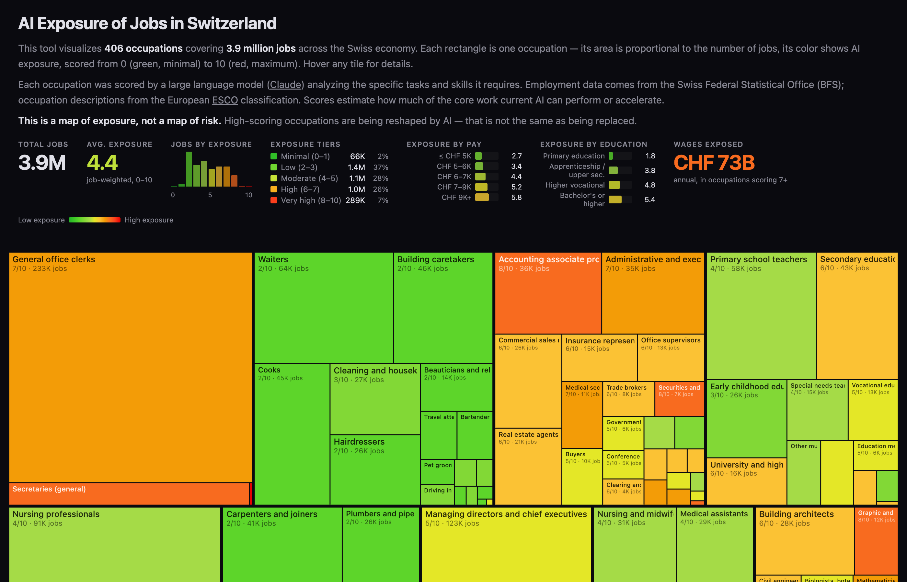

# AI Exposure of Jobs in Switzerland

Interactive treemap visualizing AI exposure scores for 406 Swiss occupations covering 3.9 million jobs.

**[Live demo →](https://ipols.github.io/swiss-jobs/)**



## How it works

Each occupation is scored 0–10 for AI exposure using an LLM ([Claude](https://anthropic.com)) analyzing the specific skills and tasks it requires, enriched with data from the European [ESCO](https://esco.ec.europa.eu) framework (skills, knowledge, competences per occupation).

The treemap sizes each tile by employment and colors it by AI exposure: green (low) → red (high).

## Data sources

| Source | What | Year |
|--------|------|------|
| [BFS Strukturerhebung](https://www.bfs.admin.ch) | Employment by occupation (4-digit ISCO) | 2019–2021 (pooled) |
| [BFS ESS](https://www.bfs.admin.ch) | Median wages (2-digit groups) | 2022 |
| [ESCO REST API](https://esco.ec.europa.eu) | Skills, knowledge, competences per occupation | 2024 |
| Classification | CH-ISCO-19 (Swiss adaptation of ISCO-08) | — |

## Pipeline

```
BFS Strukturerhebung Excel
  → parse_se.py → occupation_tree.json, occupations_4digit.json

BFS SAKE + ESS APIs
  → fetch_occupations.py → occupations.json (wages at 2-digit level)

ESCO REST API
  → fetch_esco_fast.py → esco/occupations_full.json (skills per occupation)

All of the above
  → score.py (Claude API + prompt.md) → scores.json

All of the above
  → build_site_data.py → site/data.json → site/index.html
```

## Reproduce

Requires Python 3.12+ and [uv](https://docs.astral.sh/uv/). An [Anthropic API key](https://console.anthropic.com/) is needed for scoring.

```bash
# Setup
cp .env.example .env   # Add your ANTHROPIC_API_KEY
uv sync

# 1. Parse BFS employment data (requires beruf_se_24311552.xlsx in data/)
uv run python parse_se.py

# 2. Fetch wage data
uv run python fetch_occupations.py

# 3. Fetch ESCO skill data (~10 min, 8 concurrent threads)
uv run python fetch_esco_fast.py

# 4. Score all occupations with Claude (~30 min, incremental save)
uv run python score.py

# 5. Build site data
uv run python build_site_data.py

# 6. Preview
python3 -m http.server 8080 -d site
```

## Scoring methodology

The scoring prompt (`prompt.md`) instructs Claude to evaluate each occupation across four dimensions:

1. **Core task automation** — can AI perform the main work?
2. **Productivity amplification** — does AI make workers faster?
3. **Physical/presence barrier** — does the job require hands-on or in-person work?
4. **Swiss labor market context** — regulatory, cultural, and institutional factors

Each occupation receives a score (0–10), confidence level, short rationale (for tooltips), and detailed analysis. The full prompt is included in the repo for transparency.

**Caveat:** These are model-generated estimates, not rigorous predictions. A high score means the work is being reshaped by AI — not that jobs will disappear.

## Tech stack

- **Data pipeline:** Python, [Anthropic SDK](https://github.com/anthropics/anthropic-sdk-python), httpx, openpyxl
- **Visualization:** Single-file HTML/CSS/JS, Canvas API, squarified treemap algorithm
- **Hosting:** GitHub Pages

## Credits

Inspired by [Karpathy's US Job Market Visualizer](https://karpathy.ai/jobs/).

## License

MIT
